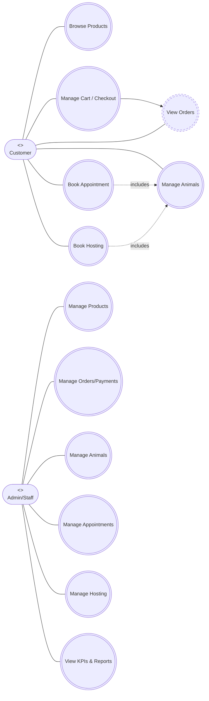

# PANDACLINIC – Use Case Overview (UML-style)

## Brief Descriptions
- **Browse Products**: Customer filters/searches products, views details and availability.
- **Manage Cart / Checkout**: Add/update/remove items, place order, select payment method.
- **View Orders**: Track order status and history.
- **Manage Animals**: Register pets, upload photo, view pet profile.
- **Book Appointment**: Schedule vet appointment; avoid slot conflicts.
- **Book Hosting**: Reserve boarding stay; check room availability; optional file upload for pet info.
- **Manage Products**: Admin CRUD products, pricing, stock, activation, images, archive/restore.
- **Manage Orders/Payments**: Admin reviews orders, updates status, handles payment follow-up.
- **Manage Animals / Appointments / Hosting**: Admin CRUD, restore soft-deleted records, resolve conflicts.
- **View KPIs & Reports**: Dashboard totals (animals, appointments, hosting, products, orders, revenue, payments, users).
